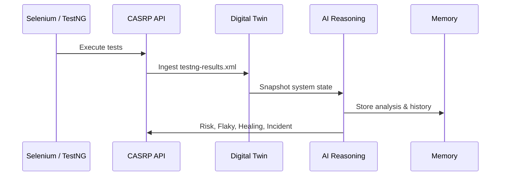

# CASRP – AI-Driven Reliability Platform

CASRP (Cognitive Autonomous System Reliability Platform) is an **AI-inspired reliability and QA intelligence system** that ingests real test execution results, maintains a digital twin of system state, assesses deployment risk, detects flaky tests, proposes remediation actions, and generates incident summaries.


---

## 🚀 Key Capabilities

### 🧠 Intelligence
- Digital Twin of system state
- Autonomous risk assessment
- Explainable AI reasoning
- Incident narrative generation

### 🧪 QA & Testing
- Real **TestNG XML ingestion**
- Event-driven test failure handling
- **Flaky test detection across runs**
- Failure severity classification

### ⚙️ DevOps
- Fully Dockerized runtime
- Production-like execution
- Stateless container design

### 👁️ Observability
- Incident timelines
- Risk-based severity
- Memory-driven analysis

---
## 🏗️ High-Level Architecture
``` mermaid
flowchart TD
    A[Selenium & TestNG<br/>Test Execution] --> B[TestNG XML Report]
    B --> C[CASRP API<br/>(FastAPI)]

    C --> C1[Ingest Test Results]
    C --> C2[System Events]
    C --> C3[Digital Twin State]
    C --> C4[Observability APIs]

    C --> D[Digital Twin]
    D --> D1[Services State]
    D --> D2[DB Schema Version]
    D --> D3[Test Failures]
    D --> D4[Risk Score]

    D --> E[AI Reasoning Layer]
    E --> E1[Risk Predictor]
    E --> E2[Flaky Analyzer]
    E --> E3[Healing Suggestions]
    E --> E4[Incident Generator]

    E --> F[Memory Layer]
    F --> F1[Event History]
    F --> F2[Failure Counts]
    F --> F3[Incident Timeline]
```

## 🔄 End-to-End Flow


---

## 🧪 Flaky Test Detection Logic

| Failures (same test) | Classification |
|---------------------|----------------|
| 1                   | Unstable       |
| 2                   | Flaky          |
| ≥3                  | Highly Flaky   |

This prevents false positives and mirrors real QA reliability practices.

---

## 📦 Tech Stack


API - FastAPI 
Language - Python 3.11 
Containerization - Docker 
Testing Input - Selenium / TestNG 
AI Logic - Rule-based, explainable reasoning
Storage - In-memory (design choice) 

---

## ▶️ Running the Project (Docker)

### Prerequisites
- Docker Desktop

### Run
```bash
docker compose up --build
```
Open:
```bash
http://localhost:8000/docs
```
## 🧪 Key API Endpoints
/ingest/testng	- Upload TestNG XML reports
/twin/state - View current digital twin
/twin/heal - View healing suggestions
/observe/incident -	Incident summary
/observe/flaky - Flaky test analysis

## 📊 Example Output
Flaky Detection
``` json
{
  "test_name": "testInvalidLogin",
  "failures": 3,
  "status": "highly_flaky"
}
```
Incident Summary
```json
{
  "severity": "medium",
  "risk_score": 0.6,
  "summary": "Incident detected with medium severity due to repeated test failures."
}
```
## 🧠 Design Philosophy
- Deterministic over black-box AI
- Explainability over complexity
- Safety before autonomy
- Real signals, no hallucinations

## 🏆 Why This Project Matters
Most QA or DevOps projects stop at test execution.

CASRP goes further:
- Understands test reliability
- Reasons about system risk
- Suggests safe remediation
- Builds incident narratives
- This reflects real SRE and platform engineering - thinking.

## 📌 Future Enhancements (Optional)
- Persistent storage
- Kubernetes deployment
- Authentication & RBAC
- Trend analysis dashboards

## 👤 Author
Chirag Guruswamy